# 🤖 NoCodeDialogFlow – Chatbot de Vendas com Dialogflow

Este laboratório tem como objetivo ensinar como criar um chatbot de vendas sem precisar programar, utilizando a plataforma Dialogflow, do Google. A ideia é simular um fluxo de conversa onde o cliente inicia a interação, demonstra interesse por um produto, e o bot conduz o atendimento de forma simples.

---

## 🛠️ 1. Criando o Agente

- Acesse o [Dialogflow](https://dialogflow.cloud.google.com)
- Crie um novo agente clicando em **"Create Agent"**.

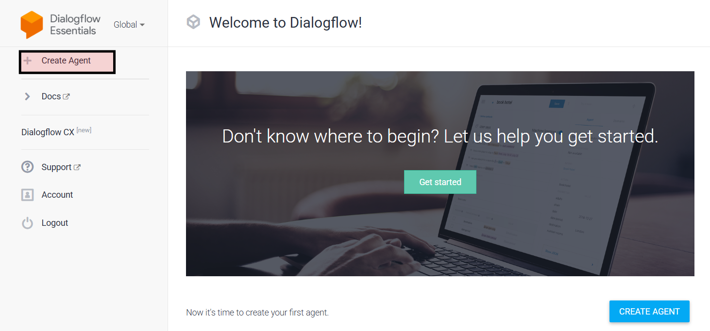

---

## ⚙️ 2. Configurando o Agente

- Preencha as informações básicas como nome do agente, idioma e fuso horário.
- Selecione ou crie um projeto do Google Cloud para conectar ao agente.

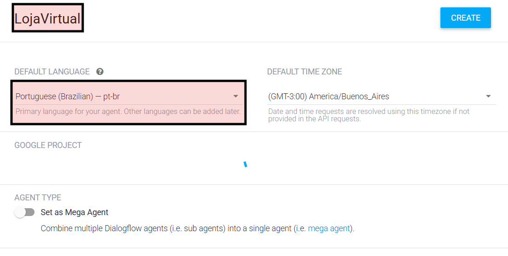

---

## 💬 3. Intenções e Primeira Resposta

### O que são **Intents**?

Intents (intenções) representam o "propósito" de uma mensagem. Com base no que o usuário diz, o Dialogflow escolhe a melhor resposta ou ação.

- Acesse o menu de **Intents**
- Selecione o **Default Welcome Intent**  
- Esse intent é ativado quando o usuário inicia a conversa com algo como “Olá”, “Oi”, etc.

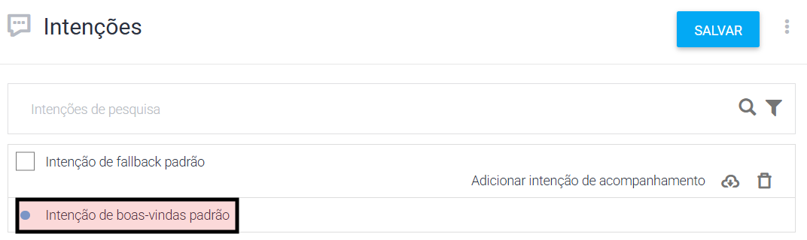

---

### Adicionando uma Resposta

- Clique em **Add Response > Text Response**
- Escreva uma saudação simpática, como:

```
Olá! Tudo bem? Posso te ajudar a escolher um produto. O que você está buscando hoje?
```

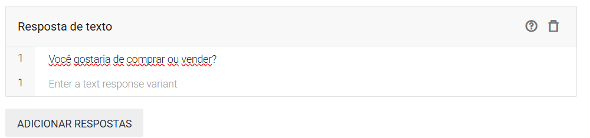

### Testando o Chatbot

- Use o painel lateral do Dialogflow para digitar "Olá"
- A resposta aparece como configurada
- Se o usuário disser algo como “Quero comprar um produto”, o bot ainda não sabe como reagir. Vamos ensinar isso a ele!

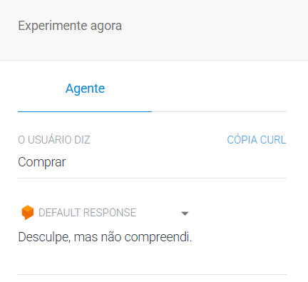

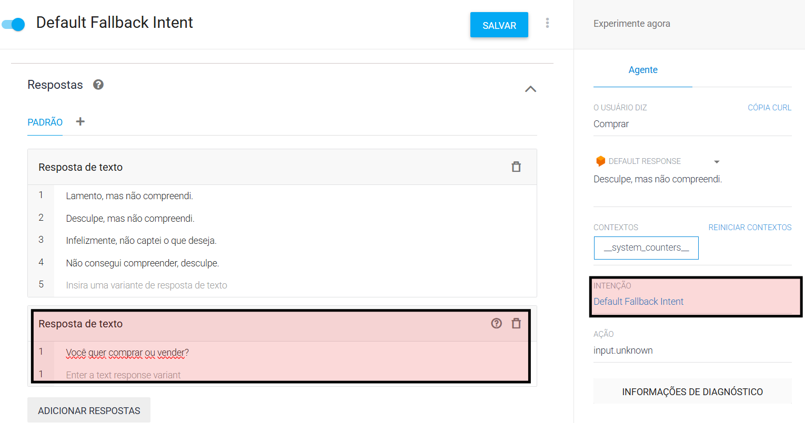

---

## 🛒 4. Criando a Intenção de Compra

- Vá até o menu **Intents**
- Clique em **"+"** para adicionar uma nova intenção
- Nomeie como `Comprar`

### Frases de Treinamento
Adicione frases que representem o que os usuários costumam dizer:

```
Quero comprar um produto  
Gostaria de adquirir algo  
Preciso de um item novo  
Tenho interesse em um produto  
```

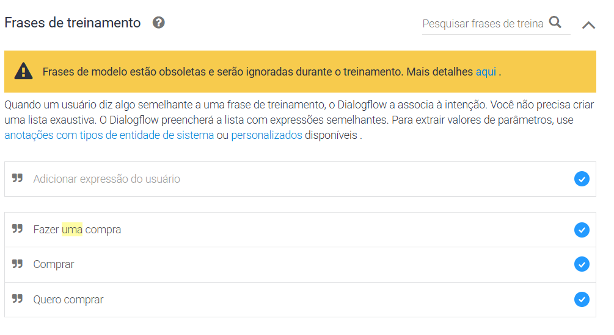

### Resposta
Adicione uma resposta inicial de direcionamento, como:

```
Ótimo! Qual produto você está procurando? Temos opções de eletrônicos, livros e roupas.
```

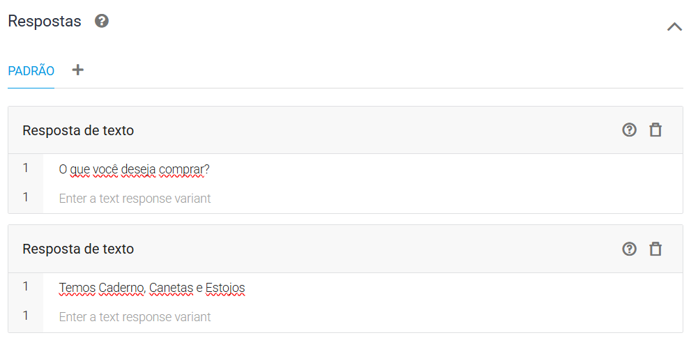

---

## 🧠 5. Adicionando Entidades

**Entidades** ajudam o Dialogflow a entender partes específicas da frase (como tipos de produto).

- Vá em **Entities**
- Crie uma entidade chamada `@produto`
- Adicione exemplos como:

```
Caderno
Estojo
Canetas  
```

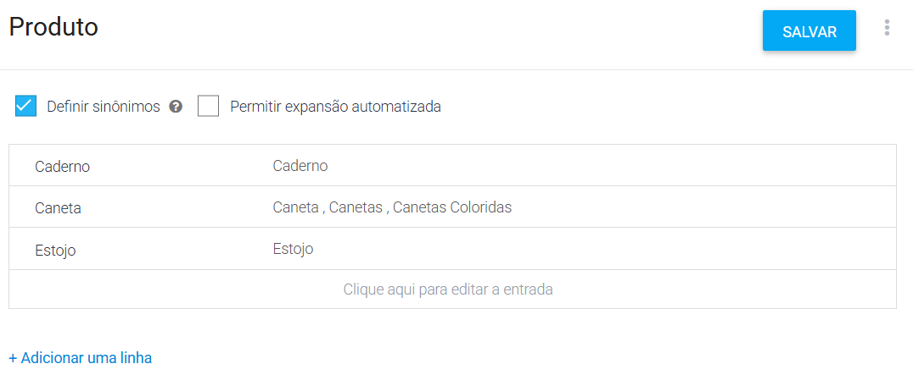

---

## 🔁 6. Usando a Entidade na Intenção

- Volte para a intenção `Comprar`
- Destaque a parte da frase que identifica o tipo de produto e associe à entidade `@produto`

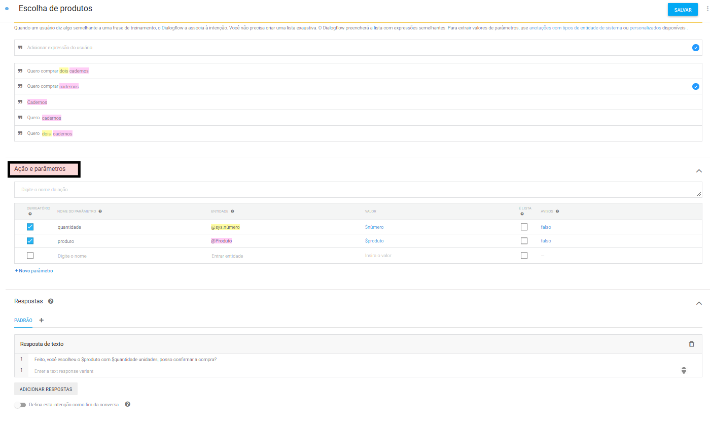

---

## ✅ 7. Confirmando a Compra (Follow-Up Intents)

- Volte para a lista de intents
- Clique na seta à direita de `Comprar` > **Add follow-up intent**
- Selecione as opções `Yes` (Sim) e `No` (Não)

> Isso cria automaticamente intenções de confirmação baseadas na resposta do usuário.

- Na opção `Yes`, adicione uma resposta como:  
  > "Perfeito! Sua compra foi registrada. Em breve entraremos em contato para finalizar o pedido."

- Na opção `No`, adicione uma resposta como:  
  > "Tudo bem! Se precisar de algo mais, estou por aqui. 🙂"

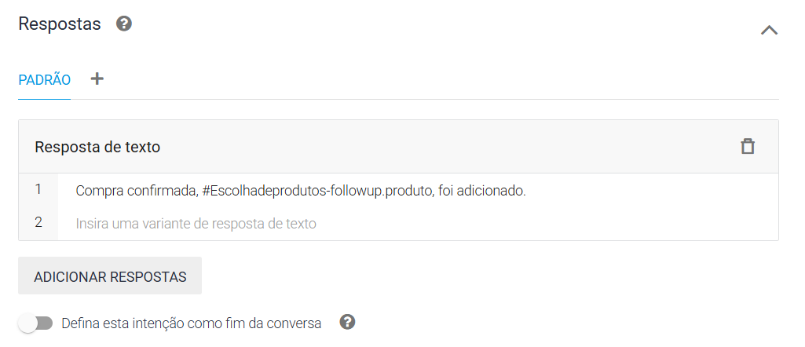

---

## 🔗 8. Integrações

Você pode integrar seu chatbot com:
- **Google Chat**
- **WhatsApp (via Twilio)**
- **Messenger**
- **Sites (via iframe)**

Acesse o menu **Integrations** no Dialogflow e escolha a opção desejada.

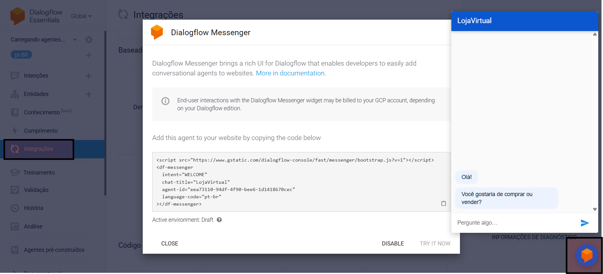

